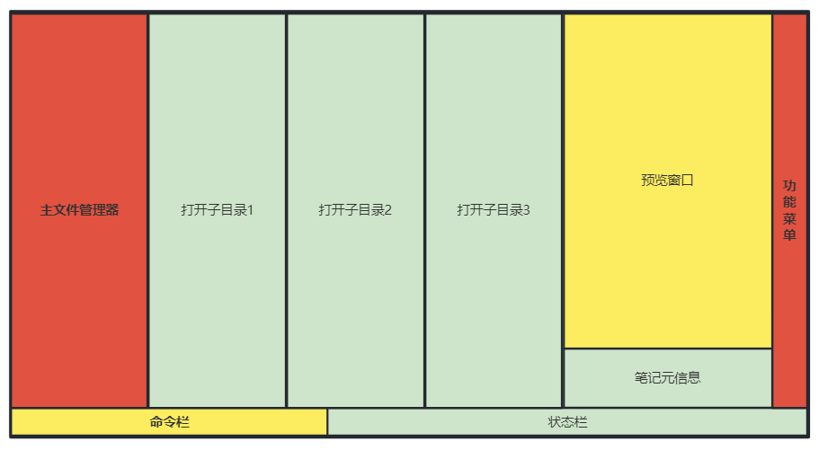
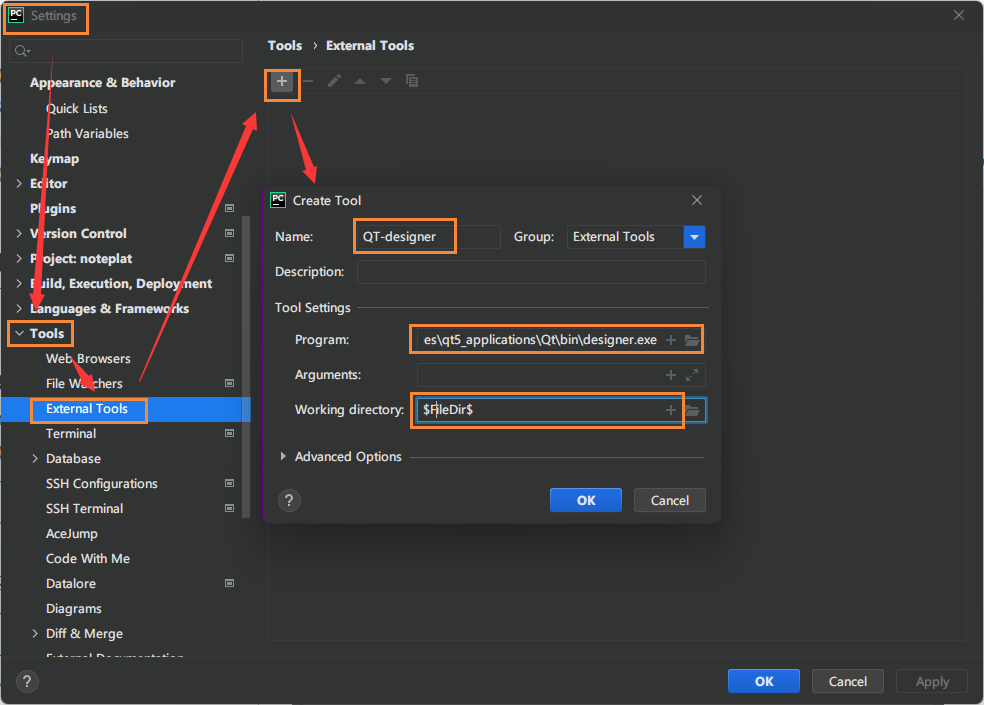
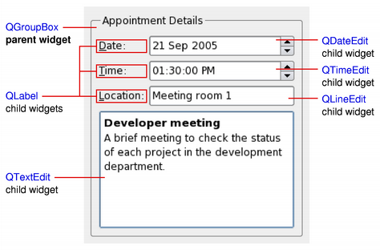
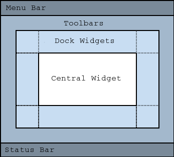

# Noteplat

> 笔记图，专门用于管理Markdown笔记的工具

## 写在前面

这个项目用来给Markdown格式的笔记做一个类似于印象笔记的笔记管理软件。

目前的思路是用Python开发，分为三层：

- 前端GUI层 -- 基于[GUI库](https://www.zhihu.com/question/457095851)、如PyQt5
- 数据交换层 -- RPC，数据解耦
- 后端实现层 --
  Python[文件管理](https://cloud.tencent.com/developer/article/1913460)、[打包](https://www.cnblogs.com/leokale-zz/p/12448854.html)、[文本处理](https://www.cnblogs.com/leokale-zz/p/12448854.html)

写这个的主要目的，一个是为了Python的练手，另一个是体验下GUI库的开发，最后是尝试下Python的exe打包过程。

## 设计框架

简单构造我们的页面，主要分为3大块，以颜色来表示重要程度：

- 红色：包括主文件管理器、功能菜单，是最优先实现的功能；
- 黄色：包括命令栏和预览窗口，命令栏可以让我们以命令交互的方式进行控制，预览可以看到文件内的具体内容；
- 绿色：包括子目录窗口、状态栏、元信息，这些优先级最低；



给出数据流图：

。。。

## 功能说明

NotePlat，最终目标是管理Markdown格式的所有笔记，具体有以下功能

- UI交互功能：可交互UI，支持鼠标与键盘触发，自动刷新机制
- 文件管理器：实现完整的文件树浏览、折叠与打开、开启子目录、新建删除重命名
- 文件预览：嵌入式的预览窗口，可实现md格式文件的预览
- 并发功能：能够实现事件并发，避免点击后卡顿或崩溃
- 数据解耦：后端实现层与前端GUI层完全解耦，以消息总线概念让数据通过RPC方式进行传输
- 搜索功能：根据要求匹配关键字，搜索笔记标题、全文搜索
- 外部程序调用：可调用Typora进行笔记编写
- 版本同步功能：可调用Git进行版本同步，Git地址可配置

## 开发记录

参考：

1、[RiverBank PyQt](https://www.riverbankcomputing.com/static/Docs/PyQt5/sip-classes.html)

2、[Qt Disnger For Windows](https://build-system.fman.io/qt-designer-download)

3、[搭建PyQt开发环境](https://www.cnblogs.com/lovesoo/p/12491361.html)

4、[W3C PyQt中文教程](https://www.w3schools.cn/pyqt/index.asp)

### 4.1 [配置PyQt开发环境](https://www.cnblogs.com/lovesoo/p/12491361.html)

1、安装pyqt工具包，建议windows下开发，避免GUI依赖库有异常：

```shell
"C:\Users\taylor Tao\AppData\Local\Programs\Python\Python38\python.exe" -m pip install PyQt5
"C:\Users\taylor Tao\AppData\Local\Programs\Python\Python38\python.exe" -m pip install PyQt5-Tools
```

2、安装完成后，开始配置PyCharm。

找到Qt Disnger，路径一般为`qt5_applications\Qt\bin\designer.exe`：



配置 PyUIC，PyUIC主要是把Qt Designer生成的.ui文件换成.py文件：

```yaml
Name: PyUIC
Program: C:\Python38\python.exe # 当前Python目录，请根据实际修改
Arguments: -m PyQt5.uic.pyuic $FileName$ -o $FileNameWithoutExtension$.py
Working directory: $FileDir$
```

配置 PyRCC，PyRCC主要是把编写的.qrc资源文件换成.py文件：

```yaml
Name: PyRCC
Program: C:\Python38\Scripts\pyrcc5.exe # 当前rcc工具目录，请根据实际修改
Arguments: $FileName$ -o $FileNameWithoutExtension$_rc.py
Working directory: $FileDir$
```

3、使用demo

参考：[一个简单的城市天气预报](https://www.cnblogs.com/lovesoo/p/12491361.html)

### 4.2 PyQt对象继承

参考：[QT中QMainWindow、QWidget、QDialog](https://www.cnblogs.com/MrYuan/p/10701287.html)

QWidget继承于QObject和QPaintDevice，QDialog和QMainWindow则继承于QWidget，QDialog、QMainWindow两者之间没有直接关系。

QWidget类是所有用户界面对象的基类。



> 窗口部件是用户界面的一个原子：它从窗口系统接收鼠标、键盘和其它事件，并且将自己的表现形式绘制在屏幕上。每一个窗口部件都是矩形，并且它们按Z轴顺序排列。一个窗口部件可以被它的父窗口部件或者它前面的窗口部件盖住一部分。
>
> QWidget有很多成员函数，但是它们中的一些有少量的直接功能：例如，QWidget有字体属性，但是自己从来不用。为很多继承它的子类提供了实际的功能，比如QLabel、QPushButton、QCheckBox等等。
>
> 没有父窗体的小部件始终是一个独立的窗口（顶级窗口部件）。非窗口的小部件为子部件，它们在父窗口中显示。Qt中大多数部件主要被用作子部件。例如：可以显示一个按钮作为顶层窗口，但大多数人更喜欢将按钮内置于其它部件，如QDialog。


QMainWindow类提供一个有菜单条、工具栏、状态条的主应用程序窗口（例如：开发Qt常用的IDE-Visual Studio、Qt Creator等）。



> 一个主窗口提供了构建应用程序的用户界面框架。Qt拥有QMainWindow及其相关类来管理主窗口。
>
> QMainWindow拥有自己的布局，我们可以使用QMenuBar（菜单栏）、QToolBar（工具栏）、QStatusBar（状态栏）以及QDockWidget（悬浮窗体），布局有一个可由任何种类小窗口所占据的中心区域。


QDialog类是对话框窗口的基类。

> 对话框窗口是一个顶级窗体，主要用于短期任务以及和用户进行简要通讯。QDialog可以是模式的也可以是非模式的。QDialog支持扩展性并且可以提供返回值。它们可以有默认按钮。QDialog也可以有一个QSizeGrip在它的右下角，使用setSizeGripEnabled()。
>
> 注意：QDialog（以及其它使用Qt::Dialog类型的widget）使用父窗口部件的方法和Qt中其它类稍微不同。对话框总是顶级窗口部件，但是如果它有一个父对象，它的默认位置就是父对象的中间。它也将和父对象共享工具条条目。

### 4.3 控件自适应缩放

参考：[PyQt5 窗体控件自适应窗口变化](https://www.jianshu.com/p/5f659108d8be)

- 在Form窗体中右键选择`布局 layout`
- 可选：
    - Lay Out in a Grid：即格栅式，每行都可插入多个控件，控件默认居中布局。
    - Lay Out in a Form Layout：每行可插入两个控件，控件默认居左布局。（尝试了很多次发现一行无法平放3个控件）
    - Lay Out Horizontally : 纵向布局
    - Lay Out Vertically：横向布局
    - Lay Out Horizontally in Splitter： 纵向分裂式布局
    - Lay Out Vertically in Splitter：横向分裂式布局

- 此时窗体与内部所有空间绑定，可自适应窗体大小

参考：[高分屏适配](https://zhuanlan.zhihu.com/p/401503085)

```python
QtCore.QCoreApplication.setAttribute(QtCore.Qt.AA_EnableHighDpiScaling)
```

### 4.4 目录树管理

参考：[创建目录树](https://www.jianshu.com/p/f00da4c146f7)

使用QTreeView构建文件管理器。

```python
    def initFileSystem(self):
    self.fileSystem = QFileSystemModel()
    self.fileSystem.setRootPath("C:\\")
    self.ui.exploreTree.setModel(self.fileSystem)
    self.ui.exploreTree.setAnimated(True)
    self.ui.exploreTree.setIndentation(20)
    self.ui.exploreTree.setSortingEnabled(True)
    self.ui.exploreTree.setWindowTitle("markdown-overview")
```

### 4.5 响应键盘事件

参考：[键盘事件和鼠标事件](https://cloud.tencent.com/developer/article/1486736)

在MainWindows.statusBar中，响应键盘事件。

- 响应colon`:`，用于执行命令
- 响应slash`/`，用于搜索关键字
- 响应escape`ESC`，用于退出当前模式

```python
    def keyPressEvent(self, event):
    key = event.key()
    flushStatusBar = lambda k: self.statusBar().showMessage(str(k), 500)
    if QtCore.Qt.Key_A <= key <= QtCore.Qt.Key_Z:
        if event.modifiers() & QtCore.Qt.ShiftModifier:
            flushStatusBar("shift+%s" % chr(key))
        elif event.modifers() & QtCore.Qt.ControlModifier:
            flushStatusBar("control+%s" % chr(key))
        else:
            flushStatusBar("abc")
    elif key == QtCore.Qt.Key_Home:
        self.statusBar().showMessage("home", 500)
    elif key == QtCore.Qt.Key_Colon:
        self.statusBar().showMessage("colon", 500)
    elif key == QtCore.Qt.Key_Slash:
        self.statusBar().showMessage("slash", 500)
    elif key == QtCore.Qt.Key_Escape:
        flushStatusBar("escape")
    else:
        QWidget.keyPressEvent(self, event)
```

参考：[pyqt5的键盘事件](https://blog.csdn.net/u011655220/article/details/79466253)

考虑到每个空间都继承keyPressEvent方法，那么应该会有输入焦点focus的考虑。

### 4.6 嵌入应用程序

参考：[Qt界面中嵌入其他exe程序的界面，使用Qt5](https://www.cnblogs.com/gaoxudong0704/p/5986730.html)

> 主要的思路就是获取到应用程序的窗口类名称，然后在Qt中利用QWindow的静态函数fromWinId，创建出QWindow对象，然后将这个对象放到一个QWidget中。

参考Qt的系统调用，以ctypes的系统调用为基础，让Typora进程嵌入到窗口应用的TabWidget上：

```python
    def openTypora(self):
    path = r'C:\Users\taylor Tao\gateway\software\Typora'
    exe = "Typora.exe"
    # 首先创建子进程，用于启动Typora
    proc = subprocess.Popen(path + "\\" + exe, shell=False)
    time.sleep(0.5)
    # 调用windll找到名称为Typora的窗口，返回int类型的句柄
    hwnd = windll.user32.FindWindowW(c_char_p(None), "Typora")
    # 从句柄中创建Qwindow，据此创建容器并附加在tabWidget上
    tWindow = QWindow.fromWinId(hwnd)
    tWidget = QWidget.createWindowContainer(tWindow, self.ui.tab)
    tWidget.setMinimumSize(400, 300)
```

> 参考：使用`ctypes`库的`windll`对象可实现调用各种API函数的功能。
>
> [ctypes sip.voidptr](https://www.coder.work/article/1284173)
>
> [ctypes模块调用API函数 ](https://blog.csdn.net/qfcy_/article/details/119513796)

句柄（Handle, 简称`hwnd`）是一个是用来标识对象或者项目的标识符，可以用来描述窗体、文件等。获取句柄后可实现窗口的控制。

```python
winname = input('输入窗口标题')
hwnd = windll.user32.FindWindowW(c_char_p(None), winname)
print(hwnd)
```

参考：[Qt 进程窗口集成](https://www.cnblogs.com/luoxiang/p/14392650.html)

最终改进的代码：

```python
    def openTypora(self):
    # 首先创建子进程，用于启动Typora
    path = r'C:\Users\taylor Tao\gateway\software\Typora'
    exe = "Typora.exe"
    os.chdir(path)
    self.process = QtCore.QProcess()
    self.process.setProcessChannelMode(QtCore.QProcess.MergedChannels)
    self.process.start(exe)
    self.process.waitForReadyRead(1000)
    # proc = subprocess.Popen(path + "\\" + exe, shell=False)
    time.sleep(0.5)
    # ！注意：必须要把句柄对应的进程设置为已有控件的子控件才可正常读写
    windll.user32.SetParent(tHandle, int(self.ui.tabWidget.winId()))
    # 调用windll找到名称为Typora的窗口，返回int类型的句柄
    hwnd = windll.user32.FindWindowW(c_char_p(None), u"Typora")
    # print(win32gui.GetClassName(hwnd))
    # 从句柄中创建Qwindow，据此创建容器并附加在tabWidget上
    tWindow = QWindow.fromWinId(hwnd)
    # tWidget = QWidget.createWindowContainer(tWindow, self.ui.centralwidget)
    self.tWidget = QWidget.createWindowContainer(tWindow)
    # 设置布局从单元格(0,1)开始，垂直方向延展2个单元，水平延展1个单元
    self.ui.gridLayout.addWidget(self.tWidget, 0, 1, 2, 1)
```

### 4.7 文件浏览窗口

参考：[打开文件或文件夹 QFileDialog](https://www.jianshu.com/p/98e8218b2309)

这里是指，打开一个目录浏览对话窗口，然后鼠标选择文件后，获取文件与文件类型的Tuple(name, type)。

```python
    def openfile(self):
    f_tuple = QFileDialog.getOpenFileName(self, '选择文件', '', 'Excel files(*.xlsx , *.xls)')
```


### 4.8 设置Icon

参考：[pyqt5给程序设置图标ico](https://zhuanlan.zhihu.com/p/590358586)

1、目录`resources`下包含所有资源文件：

```shell
resources/
├── icon
│   └── typora.ico
├── photo
│   └── preview.jpg
└── resources.qrc
```

2、资源文件定义为`resources.qrc`：

```xml
<!DOCTYPE RCC>
<RCC>
    <qresource>
        <file alias="icon">icon/typora.ico</file>
        <file alias="background">photo/preview.jpg</file>
    </qresource>
</RCC>
```

3、使用工具`pyrcc`进行压缩与编译，得到目标文件：

```shell
$ pyrcc.py -o resource_rcc.py resources.qrc
```

4、主窗口中引入：

```
import gui.resources_rc  # type: ignore
```

5、使用icon：

```python
window.setWindowIcon(QtGui.QIcon(":/icon"))
```


### 4.9 设置背景图片或颜色

```python
# Set background image or color
window.setObjectName("MainWindow")
window.setStyleSheet("#MainWindow{background-image:url(:/background);}")
window.setStyleSheet("#MainWindow{background-color: pink}")
window.ui.tabWidget.setStyleSheet("#tabWidget{background-color: pink}")
window.ui.centralwidget.setStyleSheet("#centralwidget{background-color: pink}")
window.ui.menubar.setStyleSheet("#menubar{background-color: pink}")
```


## 打包发布

参考：[PyInstaller打包](http://c.biancheng.net/view/2690.html)

IDE配置PyInstaller：

```yaml
Name: PyInstaller
Program: C:\Users\taylor Tao\AppData\Local\Programs\Python\Python38\Scripts\pyinstaller.exe
Arguments: -w -F -n Enhanced-Typora  -i "$FileDir$/resources/icon/typora.ico"  --workpath "$FileDir$/.build"  --distpath "$FileDir$/.build" --specpath "$FileDir$/.build"   $FileName$ 
Working directory: $FileDir$
```

当然也可以使用命令行，将 Python 程序转换成独立的执行文件：

```
"pyinstaller.exe"  -F main.py
```

参数解释：

>-w  # 指定程序运行时不显示命令行窗口（仅对 Windows 有效）
>
>-F  # 产生单个的可执行文件
>
>-n Enhanced-Typora  # 指定exe文件名
>
>-i "$FileDir$/resources/icon/typora-file-icon@2x.png"  # 指定exe图标
>
>--workpath "$FileDir$/.build"  # 指定生成路径，包括build等目录
>
>--distpath "$FileDir$/.build"  # 指定生成dist路径，包括exe文件
>
>--specpath  "$FileDir$/.build"  # 指定生成spec路径，包括spec文件
>
>$FileName$   # 指定入口，如main.py


## TODO

打开Enhanced-Typora后，如果就剩最后一个tab且直接关闭应用，会导致再次单独打开Typora，弹出所有上次的窗口。似乎是个Typora本身引发的异常。

1、测试当前进程

2、使用多线程（测试中，测试成功）11